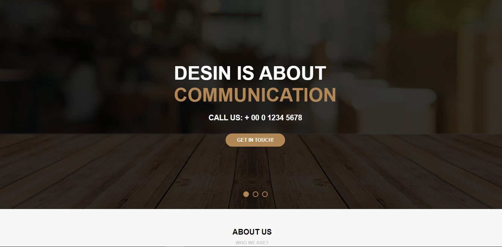
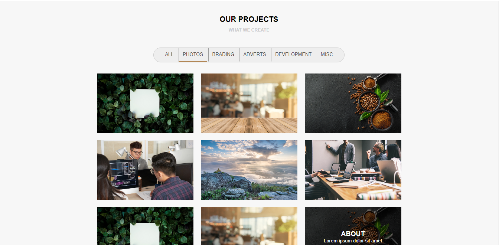

### Sobre o Projeto:
Este é meu segundo projeto desenvolvido durante o módulo de HTML/CSS do curso oferecido pela B7web, com o objetivo de evoluir a construção individual do aluno.A página web foi criada totalmente sozinha,sendo a construção de um site para uma empresa fictícia utilizando apenas HTML5 e CSS3. Além disso, incluí um formulário para contato, links de redes sociais e um a imagem de um mapa. Sendo uma página responsiva para celulares e tablets.

### Tecnologias utilizadas:

    <ul>
        <li>HTML</li>
        <li>CSS</li>
    </ul>

### Pré-visualização:

